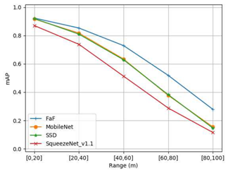
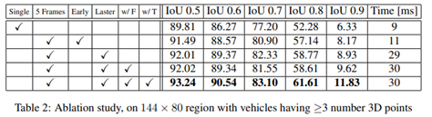
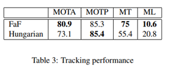
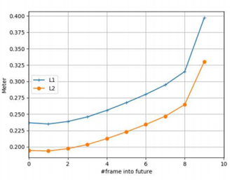

* toc
{:toc}

### **Abstract**

  본 논문에서는 3D data가 주어지면 *3D detection, tracking, motion forecasting*을 공동으로 추론할 수 있는 심층 신경망을 제안한다. 이와 같이 공동으로 추론함으로 인하여 sparse하고 occlusion(폐쇄)한 데이터에 대하여 강력한 성능을 보인다. 본 논문에서는 3D 세계의 조감도 표현을 통해 공간과 시간에 걸쳐 3D convolution을 수행한다. 이는 메모리와 계산 측면에서 큰 효율을 볼 수 있다. 본 논문에서는 계산을 공유함으로 인하여 30ms 안에 모든 작업을 수행하였고 SOTA를 뛰어넘는 결과를 보였다.

 

### 1. Introduction

현대의 자율주행 과업은 다음 4가지로 나뉜다 : detection, object tracking, motion forecasting, motion planning. Cascade 접근 방식은 다음과 같이 4개의 모델이 있고 각 모델의 출력이 다른 모델의 입력으로 들어가는 형식이다. 또한 이 4가지 모델은 일반적으로 독립적으로 학습된다. 이 때 uncertainty는 굉장히 드물게 전파되기 때문에 pipeline 시작 부분에 나타나는 오류에서 복구가 불가능 하므로 치명적인 오류로 이어지기도 한다. 

따라서 본 논문에서는 3D detection, tracking, motion forecasting을 동시에 진행하는end-to-end 방식의 fully convolution approach를 제안한다. 본 논문에서는 Tracking과 forecasting이 detection에 도움이 될 수 있으므로 이것이 중요하다고 주장한다. 또한 각 작업 간에 계산을 공유하므로 매우 효율적이기도 하다. 이는 latent가 치명적일 수 있는 자율주행에 있어 매우 중요하다.

본 논문에서는 3D 센서를 사용하고 조감도에서 작동하는 네트워크를 설계한다. 이 representation은 3D 특성을 존중하므로 네트워크가 일반적인 물체 크기에 대한 사전 정보를 활용할 수 있으므로 학습 프로세스가 더 쉬워진다. 본 논문의 접근 방식은 연속된 시간 프레임에서 생성된 4D tensor를 입력으로 사용하고 공간과 시간에 걸쳐 3D 컨볼루션을 수행하여 정확한 3D bounding box를 추출하는 one-stage-detector이다. 또한 모델은 현재의 프레임 뿐 아니라 미래의 time-stamp에 대해서도 bounding box를 생성한다. 그리고 과거와 현재의 예측 정보를 결합하는 간단한 pooling 작업을 통해 이러한 예측에서 track-set을 디코딩한다.

본 논문의 접근 방식은 SOTA를 찍었으며 모든 작업이 최소 30ms가 소요된다

### 2. Related work

**2D Object Detection** : 지금 까지 단일 2D 이미지에 대한 다양한 연구들이 이루어 졌다. 지금까지의 접근 방식은 1-step을 사용하는지 여부에 따라 2가지 범주로 구분된다. 최근의 2-stage detector는 RPN을 사용하여 RoI를 학습한다. 그리고 2번째 단계에서 RoI에 대해 average pooling된 feature로 bounding box를 예측한다(mask RCNN의 경우 RoI align). 반면 1-stage detector는 계산 적으로 매우 매력적이며 일반적으로 실시간 성을 보장한다.

**3D Object Detection** : 3D Object detection의 경우 자율 주행과 같은 3D 공간에 관심이 큰 task에서 사용한다. 2D object detection의 아이디어를 3D object detection으로 가져와 사용 가능하다.

**Object Tracking** : 이 섹션에서는 tracking에 딥 러닝을 사용하는 방법을 간략하게 검토할 것이다. Tracking 에서는 CNN을 사용하여 특징을 추출하고 correlation 또는 regression을 사용하여 추적을 수행하였다.

**Motion Forecasting** : Motion Forecasting은 과거의 프레임이 주어졌을 때 각 객체마다의 미래 위치를 예측하는 task이다. 이는 RNN이나 LSTM을 이용하여 예측을 수행하기도 하였으며 game-theory의 개념이 활용되기도 하였다.

**Multi-task Approaches** : 비디오 데이터 집합이 주어졌을 때 두 입력 이미지 사이의 해당 객체 변위를 모델링 하고 inference time에 object tube로 디코딩 하여 detection과 tracing을 동시에 하는 방법이 연구 되었었다.

### **3. Joint 3D Detection, Tracking and Motion Forecasting**

  이 작업에서는 3D point cloud를 생성하는 센서를 활용해 물체를 감지하는데 중점을 둔다. 이 목표를 위해 여러 프레임을 입력하여 미래에 대한 detection, tracking, short term motion forecasting을 수행하는 one-stage detector를 개발한다. 입력은 3D 공간 데이터에 시간 축을 껴 4D tensor 형식이다. 또한 빠르고 정확한 예측을 위해 3D convolution을 사용한다. Point cloud 데이터는 본질적으로 3D 공간에서 sparse하므로 우리의 접근 방식이 3D 공간 및 시간에 대하여 4D convolution을 수행하는 것에 비해 많은 계산을 절약할 수 있다. 본 논문에서는 자신들의 접근 방식을 Fast and Furious(FaF)라 명명하였다.

  다음에서는 먼저 voxelization(복셀화)을 포함하여 section 3.1에서 데이터 매개변수화와 시간 정보를 통합하는 방법을 설명할 것이다. 그리고 section 3.2에서는 네트워크 훈련에 사용하는 목표(section 3.3)에 따라 모델의 아키텍처를 제시할 것이다.

 

#### **3.1 Data Parameterization**

이번 section에서는 우선 single frame의 representation에 대해서 설명할 것이다. 그 후 이를 확장하여 여러 프레임을 활용해볼 것이다.

**Voxel** **Representation**: point cloud data의 경우 일반 RGB 이미지에 비하여 본질적으로 sparse 하며 3D 장면에 대한 기하학적 정보를 제공한다. 우리는 convolution을 쉽게 적용할 수 있는 representation을 얻기 위하여 3D 세계를 quantize(양자화)하여 3D voxel grid를 형성한다. 그 후 voxel의 점유 여부를 인코딩하는 각 voxel에 대해 이진 표시기를 할당한다(voxel의 3D공간에 점이 하나 이상 있으면 voxel이 occupied되었다고 하고 한다). 그리드는 규칙적인 격자이기 때문에 convolution을 직접 사용할 수 있다. 그러나 단일 프레임 representation에서는 3D convolution을 사용하지 않는다. 이는 grid가 굉장히 sparse하여 대부분의 계산이 낭비되기 때문이다(즉 대부분의 voxel이 점유되지 않으므로 계산이 낭비된다). 대신 2D convolution을 수행하고 height dimension을 channel dimension으로 처리하였다. 이를 통해 네트워크는 height dimension에서 정보를 추출하는 방법을 배울 수 있다. 이러한 접근법은 x-y 평면에서 quantize를 수행하고 수작업으로 만든 높이 통계를 계산하여 z 차원의 표현을 생성한다. 그리드의 해상도가 높으면 우리의 접근 방식은 정보 손실 없이 모든 단일 지점에 convolution을 적용하는 것과 같다. 3D point cloud 데이터에서 3D 텐서를 구성하는 방법에 대한 설명은 다음 그림을 참조하자

 

**Adding Temporal Information**: motion forecasting을 하기 위해서는 시간 정보를 고려해야 한다. 따라서 지난 n 프레임에서 모든 3D 포인트를 가져와서 현재 차량 중심 좌표계로의 좌표 변환을 수행해야 한다. 이는 센서가 장착된 차량의 ego-motion을 undo하기 위해 중요하다. 이 변환을 수행 후 각 프레임에 대한 voxel representation을 계산한다. 이제 각 프레임이 3D tensor로 표현되었으므로 새로운 temporal(시간) dimension을 따라 여러 프레임을 추가하여 4D tensor를 만든다. 이는 더 많은 3D 포인트를 제공할 뿐만 아니라 차량의 방향과 속도에 대한 단서를 제공하여 모션 예측을 수행할 수 있도록 한다. 시각화를 위해 여러 프레임을 오버레이하는 그림 3과 같이 정적 개체는 잘 정렬되고 동적 개체는 동작을 나타내는 ‘shadow’가 있다.

 

#### **3.2 Model Formulation**

본 논문의 single-stage detector는 4D input tensor를 가져와 different timestamps에서 object bounding box로 직접 회귀한다. 이번 논문에서는 4D tensor에서 시간적 차원을 활용하는 2가지 다른 방법에 대하여 조사할 것이다(초기 융합, 후기 융합). 이 둘은 정확도와 효율성 사이에서 균형을 맞추며 temporal dimension이 집계되는 수준에 따라 다르다.

**Early fusion**: 첫 번째 접근 방식은 첫 번째 계층에서 시간 정보를 집계한다. 결과적으로 단일 프레임 detector를 사용하는 것만큼 빠르다. 그러나 이는 복잡한 시간적 특징을 캡처하는 능력이 부족할 수 있다. 이는 모든 프레임에서 단일 point cloud를 생성하는 것과 비슷하기 때문이다(그러나 다른 time-stamp의 기여도에 따라 가중치를 부여하는 기능은 수행함). 특히 위의 그림 4에 표시된 것처럼 4D input tensor가 주어지면 먼저 시간 차원에서 커널 크기가 n인 1D convolution을 사용하여 시간 차원을 n에서 1로 줄인다. 따라서 모든 특성 맵간에 가중치를 공유하게 된다(이를 group convolution이라 한다). 그 후 VGG16에 따라 feature map의 각 layer수를 절반으로 줄인 convolution 및 max pooling을 수행한다. VGG16에서 마지막 convolution group을 제거하여 10개의 convolution layer만 생성한다.

**Late Fusion**: 이 경우 temporal information을 점차적으로 병합한다. 이를 통해 모델은 높은 수준의 모션 기능을 캡처 할 수 있다. 논문에서는 초기 fusion 모델에서와 동일한 수의 convolution layer와 feature map을 사용하지만 temporal dimension에서 padding 없이 2개의 layer에 대해 kernel 크기 3*3*3으로 3D convolution을 수행하여 시간 차원을 n에서 1로 줄인다. 그 후 다른 layer에 대해 커널 크기 3*3으로 2D spatial convolution을 수행한다.

그 후 다음 그림 5와 같이 convolution layer에 2가지 분기를 추가한다. 첫번째 항목은 차량이 될 확률을 예측하기 위해 binary classification를 수행하고 두번째 항목은 현재 frame과 미래의 n-1 frame에 대한 bounding box를 예측한다. 이러한 접근 방식은 여러 프레임을 입력으로 활용하므로 motion prediction이 가능하므로 속도 및 가속도와 같은 유용한 기능을 추정하는 방법을 배울 수 있다.

논문에서는 SSD에 이어 각 feature map 위치에 미리 정의된 여러 box들을 사용하였다. Metric인 BEV representation을 활용함에 따라 네트워크는 객체의 물리적 크기에 대한 사전 정보를 활용할 수 있었다(여기서는 5m에 대하여 1:1, 1:2, 2:1, 1:6, 6:1 그리고 8m에 대하여 1:1로 총 6개의 미리 정의된 상자가 있다). 이렇게 미리 정의된 상자를 사용하면 regression target의 variance를 줄일 수 있으므로 네트워크를 쉽게 훈련시킬 수 있다. 또한 180도의 모호성을 피하기 위하여 sin값과 cos값을 모두 사용한다.

특히 미리 정의된 각 상자에 대해 네트워크는 해당 정규화 된 위치 offset과 로그 정규화된 크기 및 헤딩 매개변수(sin, cos)를 예측한다.

**Decoding Tracklets**[1](#1): 각 time-stamp에서 모델은 n개의 time-stamp에 대한 detection bounding box를 출력한다. 반대로, 각 타임 스탬프에는 현재 detection과 n-1 개의 past prediction이 있다. 따라서 trajectory based optimization 문제를 해결하지 않고도 정확한 tracklets을 생성하기 위해 과거에 대한 정보를 집계할 수 있다. 감지 및 모션 예측이 완벽하다면 완벽한 tracklets을 디코딩 할 수 있다. 실제로 평균을 aggregation function으로 사용한다. 현재와 과거의 future prediction에서 감지된 항목이 겹치는 경우 동일한 개체로 간주되고 bounding box의 평균이 계산된다. 직관적으로 집계 프로세스는 강력한 past prediction이 있지만 현재 증거가 없는 경우 (예: 개체가 현재 가려져 있거나 감지에서 거짓 음성 인 경우) 특히 도움이 된다. 이를 통해 여러 프레임에 걸쳐 occlusions 를 추적할 수 있다. 반면 우리는 현재의 강력한 증거가 있지만 과거에 대한 예측이 없는 경우 new object에대한 증거가 있다.

 

**3.3 Loss Function and Training**

본 논문은 classification 및 regression loss를 최소화하도록 네트워크를 훈련시킨다. Regression의 경우 현재 프레임과 미래를 예측하는 n frame을 모두 포함한다.(t: 현재 프레임, w: 모델의 매개변수)

또한 다음과 같이 모든 위치와 사전 정의된 box에 의해 계산된 classification loss cross-entropy를 사용한다.

Detection 및 future prediction에 대한 regression loss를 정의하려면 먼저 관련 ground truth를 찾아야 한다. 논문에서는 미리 정의된 각 상자를 모든 ground truth box와 일치시켜 대응을 정의했다. 특히 각 prediction box에 대해 먼저 IoU 측면에서 중첩이 가장 큰 ground truth box를 찾는다. IoU가 일정 threshold(0.4)보다 크면 ground truth box를 로 할당하고 해당 레이블 q~i,j,k~ 에 1을 할당한다. SSD에 따라 사전 정의된 box에 할당되지 않은 ground truth box가 있는 경우 threshold 값을 무시하고 중첩되는 가장 높은 사전 정의된 box에 할당한다. 미리 정의된 여러 상자를 동일한 ground Truth에 연결할 수 있고 일부 미리 정의된 상자에는 해당 ground Truth가 없을 수 있다. 즉 q~i,j,k~는 0이다.

 

그러므로 regression target은 다음과 같이 정할 수 있다.

또한 여기에 smooth L1 loss이 다음과 같이 정의된 모든 regression target에 대해 weighted smooth L1 loss를 사용한다.

**Hard Data Mining**

Positive 및 negative sampling으로 인해 training 중 hard negative mining을 사용한다. Positive sample은 해당 ground truth box가 있는 미리 정의된 상자로 정의한다. Negative sample의 경우 classification 분기에서 예측된 점수 pi,j,k로 모든 후보의 순위를 매기고 상위 negative를 취한다.

 

 

**4. Experimental Evaluation**

이 논문이 나왔을 시기에는 3D detection, tracking, motion forecasting을 평가하는 공개 데이터 집합이 없었다. 따라서 직접 데이터를 수집하였다.

**Dataset**: 북미에서 차량에 LiDAR를 달아 수집함. 2762개의 서로 다른 장면에서 수집된 546,658개의 프레임으로 구성. 라벨은 3D rotated bounding box와 각 차량의 track ID가 포함되어 있다. 또한 라벨러는 정확한 주석을 제공하기 위해 전체 시퀀스에 액세스 할 수 있으므로 라벨에 3D 포인트가 없는 차량이 포함될 수 있다.

**Detection Results**: SSD, MobileNet, SqueezeNet과 같은 최근의 real-time detector와 비교할 것이다. 그러나 이러한 모델은 2D 기반의 감지 작업을 하도록 개발되었으므로 경쟁력을 높이기 위해 pre-defined된 box를 시스템에 구축하여 해당 감지기의 작업을 더욱 쉽게 만들었다. 다음 표는 IoU threshold 당 mAP의 수치를 보여준다. 본 논문에서 제안한 방법이 가장 우수함을 볼 수 있다.

또한 test set에 대하여 Ground Truth의 경계 상자를 필터링하는 데 사용되는 3D 포인트 수의 함수로 성능을 평가할 것이다. High level of sparsity는 occlusion 또는 멀리 떨어져 있는 차량 때문이다. 그림 7에서 볼 수 있듯 본 논문의 방법이 가장 좋다. 시간 정보 활용의 중요성을 보여주기 위해 최소 0점으로 평가할 것이다.

 

또한 거리에 대하여 모델의 성능이 어떻게 달라지는지에 대하여도 알아보았다. 이러한 목표를 위해 prediction을 100미터까지 확장하였다. 그림 0은 거리 범위가 다른 차량에서 IoU 0.7을 사용할 때의 성능은 그림 8과 같다. 거리가 멀어지면 3D 포인트가 지나치게 적어지므로 성능이 떨어진다.

**Ablation Study**: 프레임 워크 내에서 ablation study를 수행하여 각 구성 요소가 얼마나 중요한지를 보였다. 모든 실험에 대한 training setup을 수정했다. 표 2에서 볼 수 있듯 early fusion과 동일한 정보를 사용하면 IoU 0.7에서 mAP가 3.7% 향상된다. later fusion은 초기 fusion과 동일한 정보를 사용하지만 더 복잡한 시간적 특징을 모델링 할 수 있으므로 1.4%의 추가 향상을 얻을 수 있다.[2](#2)

**Tracking**: 우리의 모델은 track ID로 detection이 가능하다. 정교한 tracking pipeline을 추가하지 않고 raw tracking output을 평가할 것이다. 다음의 표3은 모델의 출력과 감지 결과 위에 Hungarian method간의 비교를 보인다. 우리는 KITTI protocol을 따르고 100개의 모든 검증 시퀸스에서 MOTA, MOTP, Mostly-Tracked 및 Mostly-Lost를 계산한다. 그럼 MOTP를 제외한 모든 방법에서 더 뛰어난 성능을 보이는 것을 알 수 있다.

**Motion Forecasting**: vehicle center location의 평균 L1 및 L2 거리를 계산하여 모델의 예측 능력을 평가한다. 그림 0에서 볼 수 있듯 L2 거리가 0.33 미터 미만인 미래 10 frame을 예측할 수 있다. 문제의 특성으로 인해 실제 긍정에 대해서만 평가할 수 있으며, 우리의 경우 해당하는 recall은 92.5% 이었다.

**Qualitative Results**: 그림 10은 144*80 미터 지역에 대한 결과를 보여준다. 우리는 4개의 sequence를 제공하고, 상위 3개 행은 우리 모델이 복잡한 장면에서 잘 수행 할 수 있음을 보여줌으로서 소형 차량과 대형 트럭 모두에 정확하게 rotated bounding box를 제공한다. 또한 우리 모델은 빠르게 움직이는 차량과 정적 차량 모두에 대해 정확한 미래 모션을 제공한다. 마지막 행은 중앙 오른쪽 파란색 차량에서 탐지기가 실패한 하나의 실패 사례를 보여준다.

**5. Conclusion**

자율 주행 시나리오에서 detection, prediction 및 tracking을 공동으로 추론하는 전체론적 모델을 제안하였다. 우리는 그것이 실시간으로 실행되고 모든 작업에서 우수한 성능을 보임을 증명하였다. 또한 보행자와 같은 다른 범주에 대해서도 테스트하고 장기적인 예측을 생성할 계획이다.

 

**각주**

 <b id="footnote1">1</b> 이미지 인식 시스템에 의해 구성된 “moving object”가 뒤 따르는 track 조각.

 <b id="2">2</b> single 보다는 5 frame의 정보를 이용하는 것이 좋다. Early fusion보다는 later fusion이 좋다