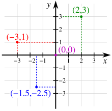

* toc
{:toc}

## Robotics란?

로보틱스(Robotics)는 로봇의 설계, 제작, 제어, 운영, 응용 등을 연구하는 학문 분야입니다. 본 포스팅에서는 주로 로봇의 **제어**와 **운영**에 대해 다루겠습니다.

### 기구학(Kinematics)

기구학(Kinematics)은 로봇 공학에서 중요한 역할을 하며, 로봇의 움직임을 분석하고 제어하는 데 필수적인 수학적 기초를 제공합니다. 로봇의 관절과 링크의 움직임을 계산하고, 로봇의 끝부분이 특정 위치에 도달하도록 각 관절이 어떻게 움직여야 하는지를 알아내는 것이 기구학의 핵심입니다. 기구학은 크게 **정기구학(Forward Kinematics)**과 **역기구학(Inverse Kinematics)**으로 나뉘며, 이를 이해하기 위해서는 몇 가지 중요한 개념들을 알아야 합니다.

#### 필수 용어

* 링크(Link): 로봇의 관절 사이에 위치한 강체 부분으로, 로봇의 구조를 이루는 중요한 요소입니다. 링크는 로봇의 구성 요소 중에서 움직이지 않는 부분이나, 서로 다른 관절에 의해 연결된 이동 가능한 부분을 가리킵니다.

* 관절(Joint): 두 링크를 연결하고, 한 링크가 다른 링크에 대해 움직일 수 있게 하는 부분입니다. 관절은 로봇의 이동성을 제공하는 핵심 요소로, 회전하거나 직선 이동이 가능합니다. 종류로는 아래 2가지가 있습니다.
    * Revolute Joint: 회전 운동이 가능한 관절
    * Prismatic Joint: 직선 운동이 가능한 관절

* 엔드 이펙터(End Effector): 로봇 팔의 끝에 위치한 장치로, 특정 작업을 수행하기 위해 사용되는 도구.로봇 팔의 손과 같은 역할을 하며, 다양한 작업 환경에서 물체를 잡거나 조작하는 기능을 합니다. End Effector는 로봇이 작업을 수행하는 데 있어 중요한 역할을 하며, 그 설계는 작업의 유형에 따라 매우 다양하게 달라질 수 있다.

    

* 자유도(Degree of Freedom, DOF): 로봇이 독립적으로 움직일 수 있는 축 또는 방향의 수. 

* 작업공간(Workspace):로봇의 End-Effector가 도달할 수 있는 모든 위치의 집합을 말합니다. 로봇의 구조와 각 관절의 움직임 범위에 따라 작업공간이 결정됨

* 정방향 기구학(Forward Kinematics): 각 joint의 위치나 각도가 주어졌을 때 End-Effector의 위치와 방향을 계산하는 방법

* 역방향 기구학(Inverse Kinematics): End-Effector가 도달해야 할 목표 위치가 주어졌을 때 각 joint의 위치나 각도를 계산하는 과정.

* DH parameter: 로봇의 링크와 관절을 수학적으로 표현하기 위한 표준화된 방법입니다. 각 링크의 위치와 회전을 수학적으로 나타내기 위해 네 가지 파라미터(link 길이, link 비틀림, joint 각도, joint 오프셋)를 사용.

* 특이점(Singularity): 로봇이 특정 위치에서 움직임이 불가능하거나, 매우 제약되는 상태를 나타냄.

* 구면 좌표계(Spherical Coordinates): 로봇의 위치나 방향을 나타내는 좌표계 중 하나로, 반경, 세로 각도, 가로 각도(예: 반경 r, 세로 각도 θ, 가로 각도 φ)로 표현됨.

    
    

* 직교 좌표계(Cartesian Coordinates): 로봇의 위치를 나타내는 기본적인 좌표계로, x, y, z 축을 기준으로 공간에서의 위치를 표현.

    

#### 좌표계(Cartesian Coordinate System)

기구학에서 로봇의 위치와 방향을 표현하기 위해 **좌표계(Cartesian Coordinate System)**가 사용됩니다. 각 로봇의 링크는 서로 다른 좌표계에 기반한 위치와 방향을 가지며, 이를 통합적으로 이해하기 위해 다음을 알아야 합니다:

* **세계 좌표계(World Frame)**: 로봇의 전체적인 움직임을 나타내는 기준 좌표계.
* **국부 좌표계(Local Frame)**: 각 링크 또는 관절에 설정된 좌표계.
* **변환 행렬(Transformation Matrix)**: 한 좌표계에서 다른 좌표계로의 변환을 나타내는 행렬.회전과 이동을 포함하며, 보통 4x4 행렬이 사용됨.

### ROS(Robot Operating System)

ROS는 로봇 소프트웨어 개발을 위한 오픈 소스 프레임워크입니다. ROS는 주로 로봇 제어, 센서 데이터 처리, 모션 계획 등을 쉽게 구현할 수 있도록 도와주며, 다양한 로봇 애플리케이션을 개발하고 테스트하는 데에 널리 사용됩니다. ROS는 운영 체제라기보다는 로봇 소프트웨어 개발에 필요한 기능들을 제공하는 툴킷에 가깝습니다. 모듈화된 구조 덕분에 다양한 패키지나 노드를 서로 독립적으로 개발하고 조합할 수 있어 확장성과 재사용성이 높습니다.

#### 용어정리

* 노드(Node): ROS 시스템에서 기본적으로 실행되는 프로세스 단위입니다. 각 노드는 **독립적**으로 실행되며, 로봇의 다양한 기능을 담당합니다. 예를 들어, "arm_controller"라는 노드는 각 관절의 위치를 받아 움직임을 제어하고, "vision_processing"이라는 노드는 카메라 데이터를 받아 물체의 위치를 추적할 수 있습니다. 이 두 노드는 서로 독립적으로 실행되며 필요한 데이터를 주고받습니다.

* 토픽(Topic): 노드 간에 비동기식 통신을 위한 통신 채널입니다. Publisher가 데이터를 특정 토픽에 송신하면, Subscriber는 해당 토픽을 구독하여 데이터를 수신합니다. 예를 들어, "arm_controller" 노드는 "joint_angles"라는 토픽을 통해 현재 각 관절의 위치 정보를 보내고, "vision_processing" 노드는 "detected_object"라는 토픽을 통해 인식한 물체의 위치 정보를 송신할 수 있습니다. 로봇팔 제어 시스템은 이 정보를 통해 물체를 집는 동작을 수행할 수 있습니다.

* 서비스(Service): 노드 간의 동기식 통신을 위한 개념입니다. 서비스는 요청(request)과 응답(response) 방식으로 작동하며, 특정 작업을 요청하고 그 결과를 받을 수 있는 메커니즘입니다. 예를 들어, "move_arm" 서비스는 사용자가 로봇팔의 특정 위치로 이동하도록 요청(request)하고, 그 결과(response)로 이동이 완료되었는지 여부를 반환합니다. 이 방식은 로봇팔이 명령을 정확하게 수행하고 응답할 수 있도록 동기식으로 작동합니다.

* 메시지(Message): 노드 간 통신에 사용되는 데이터 구조입니다. 예를 들어, 이미지, 레이저 데이터, 속도 등의 다양한 형태의 데이터가 메시지로 정의되고 주고받을 수 있습니다. 로봇 팔을 예로 들면, "JointAngles.msg"라는 메시지는 6자유도(6-DOF)를 가진 로봇팔의 각 관절의 위치를 실시간으로 업데이트하는 데이터로 정의됩니다. 이를 통해 노드 간에 데이터를 주고받을 수 있습니다.

* 액션(Action): 시간이 걸리는 작업(예: 로봇의 이동 명령)을 수행할 때 사용되는 개념입니다. 요청을 보낸 후 작업이 완료될 때까지 진행 상황을 모니터링하거나 중간에 취소할 수 있습니다. 예를 들어, "pick_and_place" 액션은 물체를 잡는 동작을 요청하고, 이 과정에서 로봇팔의 이동 경로, 물체를 잡았는지 여부 등을 지속적으로 피드백하며 완료되기까지 상태를 모니터링할 수 있습니다.

* 패키지(Package): ROS 소프트웨어 구성 요소들의 집합입니다. 각 패키지는 노드, 라이브러리, 설정 파일, 런치 파일 등을 포함할 수 있으며, ROS 시스템에서 소프트웨어를 배포하고 관리하는 기본 단위입니다.

* 런치 파일(Launch File): 여러 노드를 한 번에 실행하거나 ROS 시스템을 설정하는 데 사용되는 XML 형식의 스크립트 파일입니다. 주로 시스템을 빠르고 일관되게 구성하는 데 사용됩니다.

* TF(Transform): 좌표계 간의 변환을 관리하는 도구입니다. 예를 들어, 로봇 팔의 관절 좌표계와 로봇 본체의 좌표계를 동기화하거나, 카메라의 좌표계와 로봇의 좌표계를 연결할 때 사용됩니다. 예를 들어, 카메라에서 인식한 물체의 위치를 로봇팔이 움직이는 좌표계로 변환해야 합니다. 이 경우, TF를 사용하여 카메라와 로봇팔 사이의 상대적인 좌표 변환을 설정할 수 있습니다.

* ROS Master: ROS 시스템에서 모든 노드 간의 통신을 관리하는 중심 서버 역할을 합니다. 각 노드는 매스터와 통신하여 자신의 존재를 알리고 다른 노드와의 연결을 설정합니다. 예를 들어, "arm_controller" 노드와 "vision_processing" 노드는 각각 ROS 매스터에 자신을 등록하고, 이를 통해 서로 주고받을 데이터를 쉽게 찾고 통신을 설정할 수 있습니다. ROS 매스터는 네트워크 상에서 노드 간의 통신을 관리하는 허브 역할을 합니다.

* RViz: 로봇의 상태나 센서 데이터를 시각화하기 위한 도구입니다. 로봇이 인식하는 환경, 레이저 스캔, 카메라 이미지 등을 3D로 확인할 수 있습니다. 예를 들어, 로봇팔이 특정한 물체를 잡으려고 움직이는 상황에서, 각 관절의 위치, 로봇팔의 말단이 가리키는 방향, 카메라로 인식한 물체의 위치 등을 3D 시각화하여 실시간으로 볼 수 있습니다. 이를 통해 로봇팔의 동작을 직관적으로 파악할 수 있습니다.

* Gazebo: ROS와 통합된 물리 기반 로봇 시뮬레이터입니다. 가상 환경에서 로봇을 제어하고 테스트할 수 있는 기능을 제공하며, 물리적인 로봇을 사용하기 전에 시뮬레이션에서 기능을 검증할 수 있습니다. 예를 들어, 가상의 환경에서 물체를 잡는 작업을 시뮬레이션하여, 로봇팔의 각 관절 움직임, 중력, 충돌 등의 물리적 요소를 고려한 동작을 테스트하고, 실제 로봇팔을 사용하기 전에 문제를 사전에 발견할 수 있습니다.

#### Summary

| 용어     | 사용 예 |
|----------|----------|
| Node     | "arm_controller"라는 노드는 각 관절의 위치를 받아 움직임을 제어하고, "vision_processing"이라는 노드는 카메라 데이터를 받아 물체의 위치를 추적할 수 한다.     |
| Topic    |  "arm_controller" 노드는 "joint_angles"라는 토픽을 통해 현재 각 관절의 위치 정보를 보내고, "vision_processing" 노드는 "detected_object"라는 토픽을 통해 인식한 물체의 위치 정보를 송신한다.      |
| Service  | "move_arm" 서비스는 사용자가 로봇팔의 특정 위치로 이동하도록 요청(request)하고, 그 결과(response)로 이동이 완료되었는지 여부를 반환한다.     |
| Message  | "JointAngles.msg"라는 메시지는 6자유도(6-DOF)를 가진 로봇팔의 각 관절의 위치를 실시간으로 업데이트하는 데이터 구조로 정의된다.     |
| Action   | "pick_and_place" 액션은 물체를 잡는 동작을 요청하고, 이 과정에서 로봇팔의 이동 경로, 물체를 잡았는지 여부 등을 지속적으로 피드백하며 완료되기까지 상태를 모니터링한다.     |
| Package  | 로봇팔 제어를 위한 패키지에는 "arm_control_package"라는 이름으로, 관절 제어 노드, 물체 인식 노드, 메시지 정의 파일, 설정 파일 등이 포함될 수 있다.     |
| Launch File | 로봇팔의 모든 관절 제어와 카메라를 통한 물체 인식 노드를 동시에 실행하도록 설정할 수 있다.     |
| Transform   | 카메라에서 인식한 물체의 위치를 로봇팔이 움직이는 좌표계로 변환해야 하는 경우, TF를 사용하여 카메라와 로봇팔 사이의 상대적인 좌표 변환을 설정할 수 있다.    |
| ROS Master  | "arm_controller" 노드와 "vision_processing" 노드는 각각 ROS 매스터에 자신을 등록하고, 이를 통해 서로 주고받을 데이터를 쉽게 찾고 통신을 설정할 수 있다. ROS Master는 네트워크 상에서 노드 간의 통신을 관리하는 허브 역할을 한다.     |
| RViz   | 로봇팔이 특정한 물체를 잡으려고 움직이는 상황에서, 각 관절의 위치, 로봇팔의 말단이 가리키는 방향, 카메라로 인식한 물체의 위치 등을 3D 시각화하여 실시간으로 볼 수 있고, 이를 통해 로봇팔의 동작을 직관적으로 파악할 수 있다.     |
| Gazebo | 가상의 환경에서 물체를 잡는 작업을 시뮬레이션하여, 로봇팔의 각 관절 움직임, 중력, 충돌 등의 물리적 요소를 고려한 동작을 테스트하고, 실제 로봇팔을 사용하기 전에 문제를 사전에 발견할 수 있다.   |

